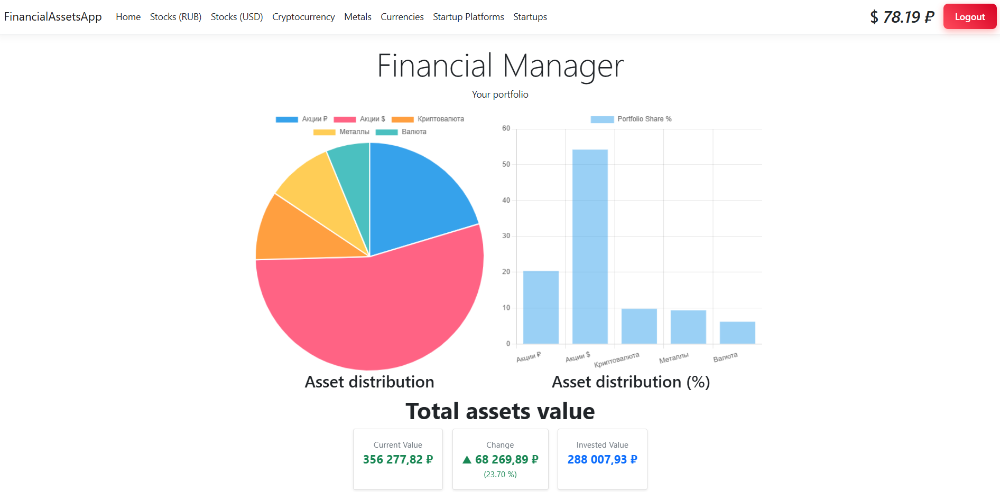
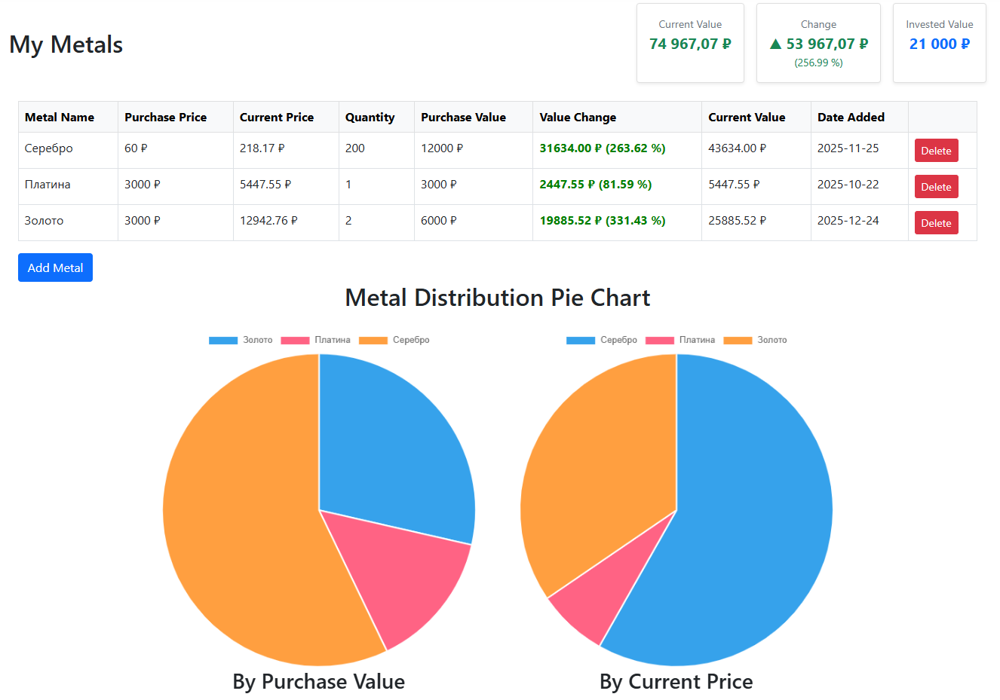

# Finance Assets Manager

A full-stack web application for tracking personal investment portfolios in real time.  
Supports stocks, cryptocurrency, currency, and metals — with automated calculations and visual charts.
You can view your assets in ine place, even if they were purchased in different places!


---

## Features
- Add, edit, and remove financial assets (stocks, crypto, currency, metals)
- Real-time portfolio value tracking with automated calculations
- Visual charts for portfolio performance overview
- Secure user authentication with isolated data per account
- Live pricing via external financial data sources (5 integrations)
- Responsive UI built with HTML, CSS, and JavaScript

---

## Tech Stack

| Layer | Technology |
|---|---|
| Backend | C#, ASP.NET Core MVC, REST API |
| Database | PostgreSQL 16, Entity Framework Core |
| Auth | BCrypt password hashing |
| Frontend | HTML, CSS, JavaScript, Chart.js |
| DevOps | Docker, Docker Compose |

---

## Screenshots




--- 

## Getting Started

### Prerequisites

- [.NET 8 SDK](https://dotnet.microsoft.com/download/dotnet/8.0)
- [PostgreSQL 16](https://www.postgresql.org/download/)
- [Docker](https://www.docker.com/) (optional, for containerized setup)
- [Node.js](https://nodejs.org/) (for frontend dependencies)

### Installation

1. **Clone the repository**
```bash
   git clone https://github.com/AntoniKR/Finance_Assets_Manager.git
   cd Finance_Assets_Manager/FinancialAssetsApp
```

2. **Configure the database**  
   Open `FinancialAssetsApp/appsettings.json` and update the connection string:
```json
   "ConnectionStrings": {
     "DefaultConnection": "Host=localhost;Database=finance_db;Username=YOUR_USER;Password=YOUR_PASSWORD"
   }
```

3. **Install frontend dependencies**
```bash
   cd FinancialAssetsApp
   npm install
```

4. **Apply database migrations**
```bash
   dotnet ef database update
```

5. **Run the application**
```bash
   dotnet run
```
   Open your browser at `https://localhost:5001`

### Docker Setup (alternative)
```bash
docker-compose up --build
```

---

## Project Structure
```
Finance_Assets_Manager/
├── FinancialAssetsApp/
│   ├── Controllers/       # MVC Controllers
│   ├── Models/            # Entity models
│   ├── Views/             # Razor views
│   ├── Services/          # Business logic
│   ├── Data/              # EF Core DbContext
│   └── wwwroot/           # Static files (CSS, JS)
├── docker-compose.yml
└── README.md
```

---

## License

MIT — free to use and modify.